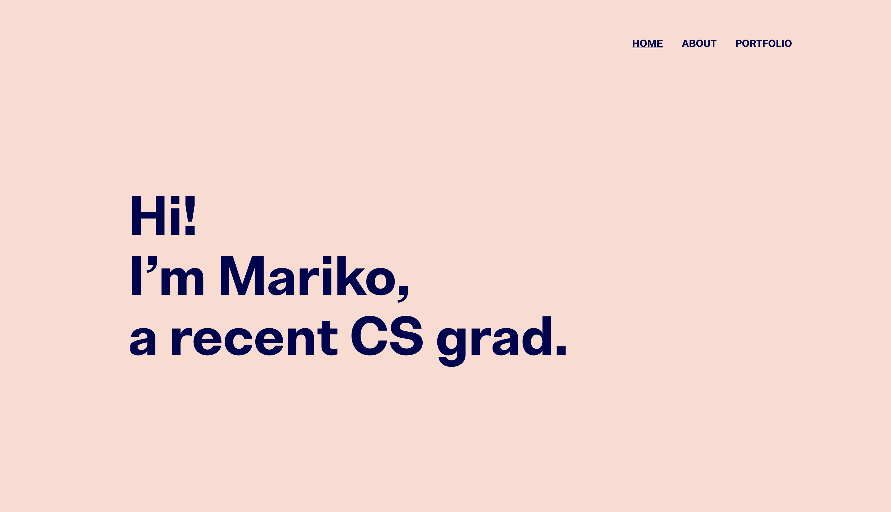

# My Portfolio Site

## Description

A simple, static portfolio website that showcases me and my work. 

## Table of Contents

* [Demo](#demo)
* [Tech Stack](#tech-stack)
* [Authors](#authors)

## Demo

View the application at [marikobriggs.com](https://www.marikobriggs.com)

## Technology Stack

* Based on [this](https://themefisher.com/products/kross-creative-portfolio-template/?edd_action=free_downloads_process_download&download_id=701154&price_ids=&edd_action=free_downloads_process_download&download_id=701154&price_ids=) template and heavily modified with 
    * [HTML5](https://html.com/html5/)
    * [CSS](https://developer.mozilla.org/en-US/docs/Web/CSS)
    * [Sass](https://sass-lang.com/)
    * and custom images 
* Hosted on [AWS Amplify](https://aws.amazon.com/amplify/)

## Authors 

* [Me, Mariko Briggs](https://github.com/marikobriggs)
